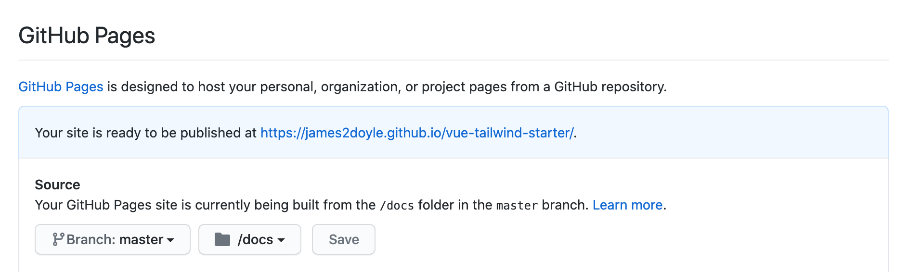

# Vue + Tailwind Starter

> A boilerplate for starting new Vue projects with Tailwind support

## Included

- [x] Easy Github Pages Deployments Via `docs` Folder ([Demo](https://james2doyle.github.io/vue-tailwind-starter/))
- [x] Vue (with Router)
- [x] [Vue Composition API](https://github.com/vuejs/composition-api)
- [x] Tailwind 2
- [x] Postcss (purgecss, import, autoprefixer)
- [x] Babel (with aliases)
- [x] ESlint (JS and Vue)
- [x] Vue PWA plugin
- [x] Editorconfig

## Project setup

```
npm install
npm run serve
```

**Production build:**

```
npm run build
```

**Github Pages:**

Go into your repo `/settings` page and change the source of your github pages to your **main branch** and the `docs` folder:



## License

[LICENSE](LICENSE)
